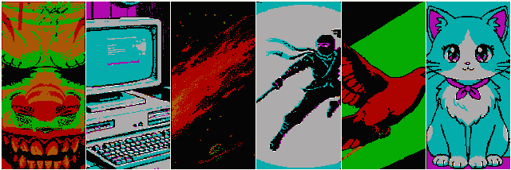

  

Tools that can help you work with the PAK format that is used in the Big Blue Disk disk magazine. Web version also can export 2 bit images to CGA graphics format.

## Disclaimer

Softdisk released the IBM PC disk magazine in 1986, and its content was written in a very interesting way, as a mix of QBASIC and Turbo Pascal compiled sources. From the start, the disk supported graphics in the form of a full-screen CGA image.
The first disk only had 3 images that were provided in a compressed pak format with an embedded CGA palette byte.

This repository is targeted to create cross-platform tools that help pack, unpack, and show content that is stored in the pak format. The source can be compiled on any C90-compatible compiler. For MS-DOS, it can be built with Borland Turbo C.

## Web Version

All tools are available directly in your favorite browser and can work totally offline. The web version is available on [Github pages](https://shadwork.github.io/C90-BigBlueDisk-Paktool/). Links to local repository tools are here:
- [PAK viewer](docs/pak_viewer.html)
- [CGA viewer](docs/cga_viewer.html)
- [CGA exporter](docs/cga_exporter.html)

## Building and Using

You can build the tools on any platform with a C90-compatible compiler. Modern OSes strictly dislike small exe files, so - no binaries. The [Release page](https://github.com/shadwork/C90-BigBlueDisk-Paktool/releases/latest) of the repository contains a 360kb floppy image with all tools that can be run on an 8088 CPU and CGA video adapter IBM PC compatible computer.
- [Latest release](https://github.com/shadwork/C90-BigBlueDisk-Paktool/releases/latest)

## PAK Format Structure

The header contains 3 bytes - color and two markers for a custom implementation of an RLE packer. There is no data that helps to identify the file format other than the extension.

| Offset (bytes) | Size (bytes) | Description |
| -------- | ------- | ------- |
| 0 | 1 | Color and palette that directly set up the CGA color palette and background color; this value is actually written to the 0x3D9 port of the IBM PC |
| 1 | 1 | marker A |
| 2 | 1 | marker B |

All content after the header is interpreted by the following rules:

- If a byte equals marker A

| Offset (bytes) | Size (bytes) | Description |
| -------- | ------- | ------- |
| 0 | 1 | marker A |
| 1 | 1 | Repeating count - 4 |
| 2 | 1 | Byte that should be repeated |

- If a byte equals marker B

| Offset (bytes) | Size (bytes) | Description |
| -------- | ------- | ------- |
| 0 | 1 | marker B |
| 1 | 2 | Repeating count |
| 3 | 1 | Byte that should be repeated |

- If a byte does not equal marker A or marker B, then it is just output 1 time.

## CMD Tools Description

### PAKTOOL.EXE

A command-line tool that can show pak file header information, unpack the file, or pack the binary data into a pak with a fixed set of markers [0xf0] and [0x05].

### PAKVIEW.EXE

Unpacks a file to CGA video memory (0xB800) with the pak palette and background color. For Windows, it creates a separate window that emulates a CGA video adapter.

### CGAVIEW.EXE

Loads any file into the CGA screen in 4-color 320x200 mode. The palette and background color are controlled with the cursor keys; press ESC to quit.